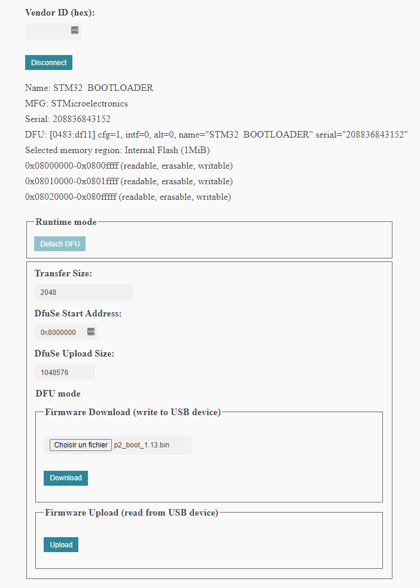

You may need to flash the memory of the preenfm if it was not done before.

The following need to be done only once. Once the bootloader is flashed, you may boot into it (hold a key while turning on the preenfm2) and flash the firmwares from it.

More information about the preenfm2 bootloader is accessible [here](http://ixox.fr/forum/index.php?topic=69716.0).


# Flash the STM32F405 on Windows

## WebDfu


Flashing the firmware is now possible from a Chrome browser:  
https://devanlai.github.io/webdfu/dfu-util/

If it works this is probabely the easier way.

Reminder to enter DFU mode :
1. Unplug the preenfm
2. Connect the 2 pins of the Boot0 pins of your preenfm2
3. Plug the preenfm

When your preenfm2 is in DFU mode and plugged to your compuer throught USB.

* Click Connect button : select "STM32 Bootloader"
* Then select the first interface of the list "DFU: cfg=1, intf=0, alt=0, name="@Internal Flash /0x08000000/04*016Kg,01*064Kg,07*128Kg"
* Keep default values and go to "Firmware Download". Click "Choose file" and select your "p2_boot_1.13.bin" from your computer.
* Verify your screen with the attached screenshot.
* Click Download




Once finished reboot while holding down a key.
You should see "- Bootloader 1.13 -" at the top of the preenfm2 screen.

## DfuSe

Another way is to download [DfuSe](https://www.st.com/en/development-tools/stsw-stm32080.html) from STMicroelectronics.   
It contains the flash programm and the usb required drivers.


Once your preenfm is in DFU mode it should show up in the top left as "STM DEvice in DFU Mode".
Then in the "Upgrade or Verify Action" click on Chose, select the [pfm2_flash.dfu](pfm2_flash.dfu) that should be in the current folder.
And click on Upgrade.

When it's done don't forget to unconnect the 2 pins of Boot0 before turning off and back on your preenfm.

## Windows 3rd solution

Use the commands as explained bellow


# Flash the STM32F405 on MacOs or Linux

On those platforms you'll have to use "dfu-util".

On linux create a new file  /etc/udev/rules.d/46-stm32F405.rules and add this content :
```
   ATTRS{idProduct}=="df11", ATTRS{idVendor}=="0483", MODE="664", GROUP="plugdev"
```

First follow steps 1,2,3 above to enter bootloader mode.

Then flash the bootloader at the adress 0×8000000. (run install_bootloader.cmd from the firmware zip file or from the current folder)

```
dfu-util -a0 -d 0×0483:0xdf11 -D p2_boot_1.11.bin -R -s 0×8000000
```

Flash the firmware at the adress 0×8040000.  (run install_firmware.cmd from the firmware zip file)

```
dfu-util -a0 -d 0×0483:0xdf11 -D pfm2_211.bin -R -s 0×8040000
```
