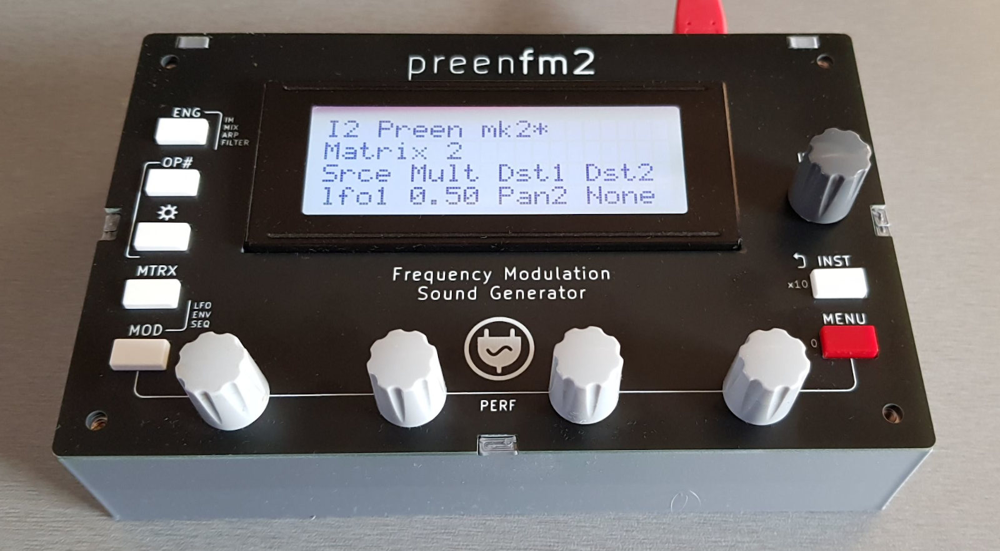

# preenfm2 2021 case

I designed this new case to have a cheap good looking case for the preenfm2.  

The top surface is a PCB. The rest of the case is made by 2 3D printable pieces (main and rear surface).  
The hole for the display fits regular 20x4 **LCD** display such as [this one](https://www.buydisplay.com/arduino-code-lcd-20x4-i2c-character-display-module-wide-view-angle).  
So check the size. You can also modify the provided Kicad PCB file. 

Other items: 
* 4 * 12 mm F/F spacers
* 2 * 20 mm M/F spacers
* 2 * 15 mm M/F spacers
* 8 * 8 mm screws
* 4 * self adhesive rubber feet (optional)
