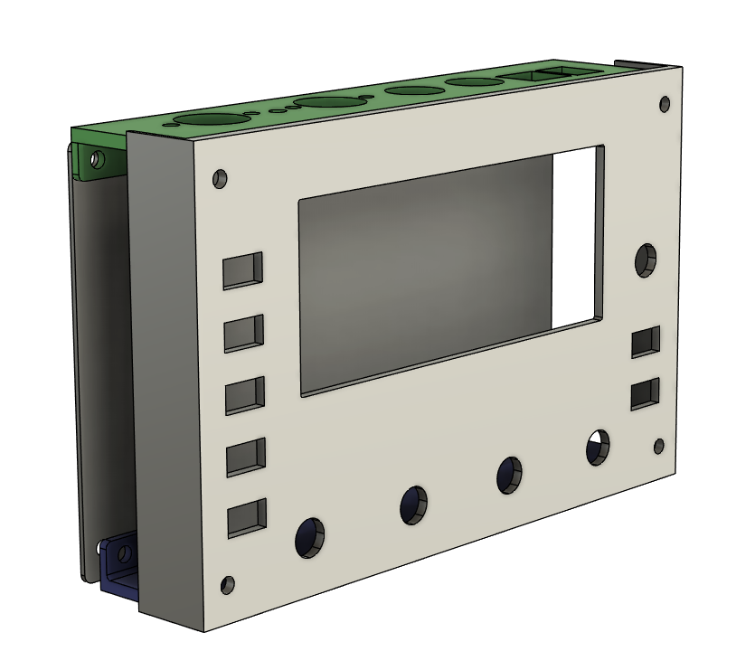
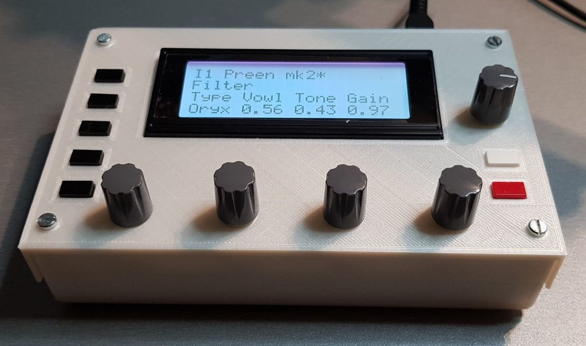

# 3D Printed Case

Here are 4 stl files that can be printed to make a minimal enclosure for your preenfm2.  
It will work with LCD display, OLED displays are smaller and the result won't be nice.  

The f3d file can be imported into fusion 360. Fusion 360 has a free version for personnal use. Using it you can customize the case and recreate the STM files.

Additional hardware :
* 4 * 12 mm F/F spacers
* 2 * 20 mm M/F spacers
* 2 * 15 mm M/F spacers
* 8 * 8 mm screws
* 4 * self adhesive rubber feet (optional)  

Screws and spacers size can be M2.5 or M3.

